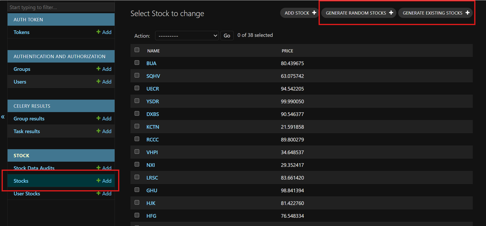

# TradeX

This README file will guide you through setting up the TradeX project on your local machine. It includes steps for creating and activating a virtual environment, installing dependencies, creating migrations, creating superuser, running the Django development server, accessing the admin site, starting the Celery worker, and configuring and running Celery Beat

## Table of Contents

1. [Getting Started](#getting-started)
    1.1. [Clone The Repository](#clone-the-repository)
2. [Setting Up the Virtual Environment](#setting-up-the-virtual-environment)
    2.2. [Create The Virtual Environment](#create-the-virtual-environment)
3. [Installing Dependencies](#installing-dependencies)
4. [Running Migrations](#running-migrations)
5. [Creating Superuser](#creating-superuser)
6. [Running the Development Server](#running-the-development-server)
7. [Accessing Django Admin](#accessing-django-admin)
8. [Testing and Evaluating the System](#testing-and-evaluating-the-system)
    8.1. [Generating Random Stocks](#generating-random-stocks)
    8.2. [Generating Existing Stocks](#generating-existing-stocks)
9. [Running Celery Worker](#running-celery-worker)
10. [Running Celery Beat](#running-celery-beat)
11. [Configuring Celery Beat Schedule](#configuring-celery-beat-schedule)
    11.1. [Understanding Crontab](#understanding-the-crontab-scheduling)
12. [Additional Resources](#additional-resources)

## Getting Started

Before you begin, ensure you have the following software installed on your machine:

- Python
- pip (Python package installer)
- Redis (for Celery and Celery Beat)
- Git

### Clone the Repository

Clone the repository using the following command:

` >> git clone https://github.com/mohammedminhaaj/Tradex-Backend.git `
` >> cd Tradex-Backend `

## Setting Up the Virtual Environment

A virtual environment isolates your Python environment for the project, ensuring that dependencies do not conflict with other projects.

### Create the Virtual Environment

Run the following command to create a virtual environment in the project directory:

` >> python -m venv venv `

This will create a directory named venv that contains the virtual environment.

### Activate the Virtual Environment

To activate the virtual environment, run the following command:

- On Windows
    ` >> venv\Scripts\activate `
- On Linux
    ` >> source venv/bin/activate `

Once activated, your command prompt should change to indicate that you are now working within the virtual environment.

## Installing Dependencies

With the virtual environment activated, install the necessary dependencies using the requirements.txt file:

` >> pip install -r requirements.txt `

This command will install all the Python packages required to run the project.

## Running Migrations

Running migrations will create the necessary tables in your database (sqlite3) which are required to run the project. To do so, we need to run the following command:

` >> python manage.py migrate `

Make sure you are in the same directory as manage.py to run this command without any errors

## Creating Superuser

To access the Django admin interface, you'll need to create a superuser. Run the following command:

` >> python manage.py createsuperuser `

You'll be prompted to enter a username, email, and password for the superuser.

## Running the Development Server

In order to access the application and Django admin interface, we need to start the development server. To start the Django development server, ensure your virtual environment is activated and run:

` >> python manage.py runserver `

The server will start, and you can access the application at http://127.0.0.1:8000/ in your web browser.

## Accessing Django Admin

Once the server is running and a superuser has been created, you can access the Django admin interface by opening your web browser and navigating to http://127.0.0.1:8000/admin/. Log in with the superuser credentials which you created previously. After logging in, you should have access to the Django admin interface where you can manage your models, users, and more.

## Testing and Evaluating the System

To test and evaluate the system, two features have been implemented that simulate real-world scenarios: Generating Random Stocks and Generating Existing Stocks. These features help create realistic data for testing and further development.

### Generating Random Stocks

This feature generates stocks with random names and random prices. Each time this function is executed, it creates a new set of stock data that does not exist in the database. This simulates the introduction of new stocks in the market.

### Generating Existing Stocks

This feature takes the existing stock names present in the database and generates new entries with varied random prices. This simulates the real-world scenario where stock prices fluctuate daily while the stock names remain the same.

These two features combined accurately depict the dynamic nature of the stock market, where new stocks are added regularly, and the prices of existing stocks fluctuate.

Once this data is generated, the Celery worker (discussed in later sections) automatically picks up the generated CSV files and stores the records in the database. This prepares the system for the front-end application to start the trading process.

These two features can be accessed inside the admin interface. Once logged in as a superuser, head over to Stocks and click on any one of the buttons to generate the data as seen in the screen shot below:



## Running Celery Worker

Celery is used for handling asynchronous tasks in this project. To start the Celery worker, use the following command:

` >> celery -A tradex worker -l INFO `

Make sure you are in the same location as your settings.py

This command will start the Celery worker, which will listen for and execute tasks defined in this project.

## Running Celery Beat

Celery Beat is a scheduler that kicks off tasks at regular intervals, which is useful for periodic tasks like updating stock prices. To start the celery beat, open another terminal (Not the one where your celery worker is running) and run the below command:

` >> celery -A tradex beat -l INFO `

This command starts the scheduler that will trigger tasks as per the schedule defined in the Celery configuration

## Configuring Celery Beat Schedule

The schedule for periodic tasks is configured in the celery.py file within the Django project.

```python

app.conf.beat_schedule = {
    "periodic": {
        "task": "stock.tasks.update_stocks",
        "schedule": crontab(minute="*/1"),
    }
}

```

### Understanding the crontab Scheduling:
- minute='*/1': This setting triggers the task every 1 minutes.
- Customizing Schedule:
    - crontab(minute=0, hour=0) – Every day at midnight.
    - crontab(minute=0, hour='*/3') – Every 3 hours.
    - crontab(minute='*/5') – Every 5 minutes.
- You can customize the schedule according to your needs by modifying the crontab settings in the celery.py file.

## Additional Resources

This project has been implemented alongside a front-end application that runs on ReactJS. You can access the front-end project through the following link:

[TradeX-Frontend](https://github.com/mohammedminhaaj/Tradex-Frontend)

This integration allows users to interact with the backend services provided by this Django application, facilitating a seamless trading experience.


